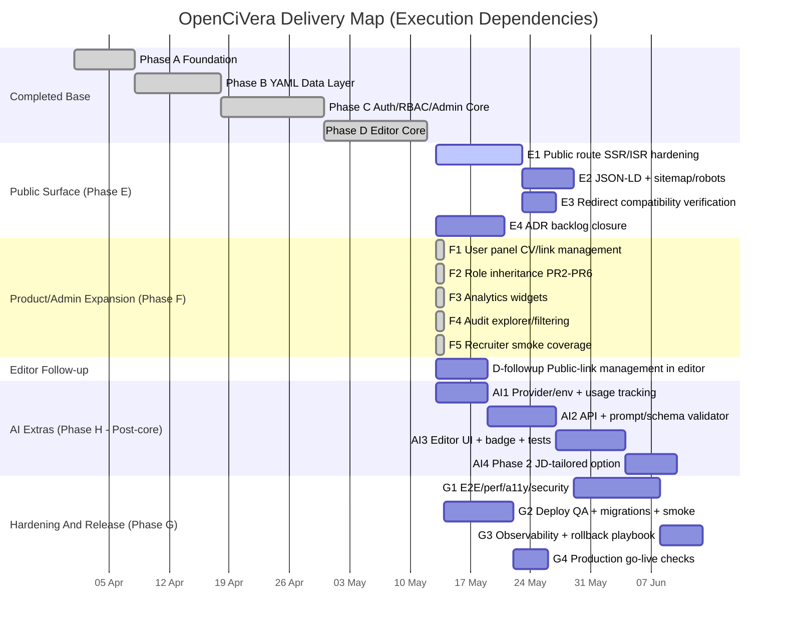

# Action Plan

This file is the consolidated execution checklist for the current project state.

Each item includes the source guide it comes from, so the detailed rationale and implementation notes remain easy to trace.

## How To Use

- Treat this file as the top-level checklist for ongoing work.
- Mark items here first when work is completed.
- Then update the originating guide if the implementation changed the documented state.

## Unified Task List (By Phase)

1. [x] Phase A - Platform foundation complete
   - [x] Baseline project foundation delivered.
     Source: [SaaS Transition Work Plan](guides/saas-transition-work-plan.md)

2. [x] Phase B - YAML-first data layer complete
   - [x] `resume_documents` is the active source of truth.
   - [x] `resume_revisions` is active and queryable.
   - [x] `resume_public_links` is present in the active model.
   - [x] Migration and validation tooling exists in the repo.
   - [x] Complete Next.js consumption of `resume_public_links` via `/r/[slug]`.
     Source: [Phase B YAML Data Layer](guides/phase-b-yaml-data-layer.md)

3. [x] Phase C - Auth, RBAC, and admin core complete
   - [x] Next.js sign up / sign in / sign out / reset flows exist.
   - [x] Email verification is enforced.
   - [x] Disposable email blocking is implemented.
   - [x] Role-aware route protection exists.
   - [x] Admin panel exists for role, status, and delete actions.
   - [x] Privileged actions are audit-logged.
     Source: [SaaS Transition Work Plan](guides/saas-transition-work-plan.md), [Phase C Auth + RBAC + Admin](guides/phase-c-auth-rbac-admin.md)

4. [x] Phase D - Editor canvas and revisioning complete
   - [x] Core editor canvas and revisioning delivered.
   - [x] Build language-version management inside Master Resume Editor for adding, editing, deleting, selecting, and setting default resume language versions.
   - [x] Merge Language Versions UX into the Master Resume Editor modal with EN as the default first badge, right-side add-language control, and left-to-right badge ordering.
   - [x] Expose public-link management from the editor or an adjacent panel.
   - [x] Align editor preview badges with future public `/r/[slug]` rendering.
   - [x] Add shared CV language switcher and public/draft badges to sample, preview, and public renderers.
     Source: [SaaS Transition Work Plan](guides/saas-transition-work-plan.md), [Phase D Resume Editor Canvas](guides/phase-d-editor-canvas.md), `.codex/state.yaml#language_modal_merge_plan`

5. [ ] Phase E - Public resume rendering and SEO/AEO
   - [x] Apply indexing controls to robots and headers for public resume pages.
   - [x] Add canonical URLs and OpenGraph/Twitter metadata for public resume pages.
   - [x] Add multilingual public CV SEO support with `hreflang`, canonical language handling, and `?lang=<locale>` support.
   - [x] Implement SSR public route `/r/[slug]`.
   - [x] Add structured data (JSON-LD) for public resume pages where applicable.
   - [x] Add sitemap and robots configuration.
   - [x] Verify compatibility redirects from legacy static routes.
   - [x] Decide and write post-PR4 ADR backlog in priority order: OpenCV YAML contract, privacy-first admin, public route compatibility/deprecation, SEO/AEO policy, Saved Version/link-management UX, analytics/audit retention, and future OpenCV export/API surface.
     Source: [SaaS Transition Work Plan](guides/saas-transition-work-plan.md), [ADR 0001 CV Publication Model](adr/0001-cv-publication-model.md), `.codex/state.yaml#adr_backlog`

6. [x] Phase F - User panel and analytics
   - [x] Build user panel for CV and link management (Dashboard/Presets).
   - [x] Add downloadable Published CV PDF export.
   - [x] Add plain text ATS-ready export for Published CV snapshots.
   - [x] Add ATS export dropdown (CVasCode / .txt / .yaml) with ATS-cleaned plain text and YAML plus raw CVasCode source export.
   - [x] Add owner-facing export controls in the editor/user panel.
   - [x] Ensure PDF and plain text exports read Published CV snapshots, not private drafts.
   - [x] Add tests for PDF/plain text export privacy, locale selection, and snapshot isolation.
   - [x] Add role-aware admin dashboard views for analytics and audit visibility.
   - [x] Add analytics widgets for counts, active links, and views.
   - [x] Add audit log explorer and filtering.
   - [x] Add recruiter baseline workflow smoke coverage.
   - [x] Implement role inheritance capability model with API guards/UI gates/SQL helpers (least-privilege, privacy-first).
     Source: [SaaS Transition Work Plan](guides/saas-transition-work-plan.md), [Phase C Auth + RBAC + Admin](guides/phase-c-auth-rbac-admin.md), [Privacy-First Admin Access Policy](guides/privacy-first-admin-access-policy.md), `.codex/state.yaml#role_inheritance_rollout_package`, `.codex/state.yaml#role_inheritance_model`
   - [x] Role inheritance PR1 complete: capability helpers and tests in `app/lib/rbac.ts`, `app/lib/auth-types.ts`, `app/lib/auth-request.ts`, `app/lib/auth-server.ts`, and `tests/**`.
   - [x] Role inheritance PR2: migrate `app/api/admin/users/**` to `admin.*` capabilities and target-aware helpers.
   - [x] Role inheritance PR3: migrate `app/api/resume/**` to `resume.*_own` capabilities.
   - [x] Role inheritance PR4: update `app/components/account-menu.tsx`, `app/admin/page.tsx`, and `app/admin/admin-users-client.tsx` to shared capability/target helpers.
   - [x] Role inheritance PR5: decide SQL alignment and add forward-only helper migration only if needed.
   - [x] Role inheritance PR6: update brittle literal-role tests, run full validation, and attach manual QA evidence.

7. [ ] Phase G - Hardening, QA, and launch readiness
   - [x] Confirm local CI-equivalent gates are green before deploy (`npm.cmd run verify`, `npm.cmd run build`).
   - [ ] Preview deploy QA is complete for the next release.
   - [ ] Production deploy QA is complete for the next release.
   - [ ] Confirm required Supabase migrations are applied.
   - [ ] Run auth smoke checks.
   - [ ] Run protected route smoke checks.
   - [ ] Run admin panel and audit smoke checks.
   - [ ] Run editor publish and rollback smoke checks.
   - [ ] Validate Netlify serves the latest build.
   - [ ] Confirm legacy redirects still resolve.
   - [ ] Capture release evidence if required.
   - [ ] Complete E2E regression suite for critical paths.
   - [ ] Run performance and accessibility checks.
   - [ ] Validate security controls and RLS behavior.
   - [ ] Finalize observability dashboards and alerting.
   - [ ] Prepare release checklist and rollback playbook.
   - [ ] Execute production smoke test protocol.
     Source: [Deployment and QA Checklist](guides/deployment-qa.md), [SaaS Transition Work Plan](guides/saas-transition-work-plan.md)

8. [ ] Phase H - AI extras (post-core delivery)
   - [ ] Add AI demo generation actions in the editor.
   - [ ] Add provider config and environment variable handling for AI generation.
   - [ ] Add `ai_resume_generations` usage tracking migration and helpers.
   - [ ] Implement `POST /api/resume/generate-demo`.
   - [ ] Add prompt builder and schema validator helpers for fictional CV generation.
   - [ ] Add editor UI, loading states, and quota messaging for demo generation.
   - [ ] Add AI badge rendering in preview and editor state.
   - [ ] Add tests for unauthorized access, quota exhaustion, validation, and happy path.
   - [ ] Add phase 2 job-description-tailored fictional CV option.
     Source: [AI Demo Resume Generation Workstream](guides/ai-demo-resume-generation-plan.md)

## Gantt Map (Dependencies And Parallel Work)

## Parallelization Notes

- Can run in parallel:
  - `E4 ADR backlog closure` with `E1 Public route SSR/ISR hardening`.
  - `F2 Role inheritance PR2-PR6` with `F1 User panel CV/link management`.
  - `D-followup` can progress independently of most Phase E/F tasks.
- Should stay sequential:
  - `E2` after `E1` (metadata/sitemap stabilizes after route behavior is final).
  - `F3/F4/F5` after `F1/F2` foundations.
  - `Phase G` hardening/release gates after core Phase E/F deliverables.

## Sprint Routing - Editor Public-Link Management

State ref: `.codex/state.yaml#public_link_management_editor_plan`.

Immediate start trigger: `.codex/state.yaml#public_link_management_editor_plan.final_implementation_sequence[PLM-FE-1]`.

Recommended kickoff is the architect Option A path: add an adjacent Saved Version/Public Link panel inside `/master-resume`, first as a read-only link-state panel, then add editor-side publish/unpublish controls through the existing owner-scoped preset APIs.

### Ticket Order

0. [x] `T0` Architect finalization.
   - Agent: `software_architect`.
   - DoR: public-link management plan exists in state.
   - DoD: final agent sequence, file ownership, dependency model, and immediate trigger are recorded in `.codex/state.yaml#public_link_management_editor_plan.final_implementation_sequence`.
1. [x] `T1` Frontend read-only Public Link panel.
   - Agent: `frontend_engineer`.
   - DoR: architect Option A is accepted; `GET /api/resume/presets` returns owner Saved Versions with `canonical_public_path` and `compatibility_public_path`.
   - DoD: `/master-resume` shows owner CV Versions with Published/Private, Indexable/Noindex, canonical URL first, compatibility URL second, Open and Copy actions only for published canonical links, and deterministic empty/loading/error states.
   - Completed: read-only panel, canonical-first/compatibility display, Open/Copy actions for published canonical links, and deterministic loading/empty/error states are implemented.
   - Gates: `node --test tests/dashboard-presets.test.mjs tests/adr-0006-saved-version-ux-contract.test.mjs`, `npm.cmd run lint`, `npm.cmd run typecheck`.
2. [x] `T2` Test lock for read-only panel.
   - Agent: `test_engineer`.
   - DoR: `T1` implementation is available.
   - DoD: tests assert editor panel presence, canonical-first display/copy affordance, private no-link state, and no direct client access to `resume_public_links`.
   - Completed: tests lock editor panel presence, canonical-first order, published-canonical Open/Copy gating, private/no-canonical no-action state, and no direct editor client reference to `resume_public_links`.
   - Validation: targeted dashboard/ADR/public-route tests passed; `npm.cmd test` passed 137/137.
   - Gates: targeted `node --test` for dashboard/ADR/public-route contract tests, then `npm.cmd test`.
3. [x] `T3` Frontend publish/unpublish controls from editor panel.
   - Agent: `frontend_engineer`.
   - DoR: `T1` and `T2` are green; dashboard publish modal contract remains stable.
   - DoD: editor panel can publish with explicit selected languages/default locale/indexing, unpublish without deleting the CV Version, refresh local link state after success, and keep Master Resume document publish/revision wording separate from Public Link lifecycle wording.
   - Completed: editor panel publishes through owner-scoped preset publish route with selected languages/default locale/indexing, unpublishes through the preset unpublish route, refreshes local link state, and keeps Master Resume revision publishing separate from Public Link lifecycle controls.
   - Validation: targeted ADR/dashboard/publication runtime tests passed 16/16; `npm.cmd run lint` passed; `npm.cmd run typecheck` passed.
   - Gates: targeted publish/public-route tests, `npm.cmd run lint`, `npm.cmd run typecheck`.
4. [x] `T4` Conditional backend contract or capability alignment.
   - Agent: `backend_engineer`.
   - DoR: frontend implementation exposes a real API gap, or role-inheritance resume API guard migration is ready.
   - DoD: preset APIs remain actor-userId scoped, expose only needed link metadata, use `resume.preset.*_own` capabilities when guard migration is in scope, and do not expose private YAML or accept arbitrary target user IDs.
   - Skipped: no backend/API gap was found; editor publish/unpublish uses the existing owner-scoped preset routes and no RLS/schema/public resolver changes were needed.
   - Gates: `node --test tests/cv-publication-runtime-contract.test.mjs tests/privacy-first-admin-access-contract.test.mjs tests/role-inheritance-rbac.test.mjs`, `npm.cmd run typecheck`.
5. [x] `T5` Full verification and deployment QA update.
   - Agent: `test_engineer`.
   - DoR: `T3` is complete and `T4` is complete or explicitly skipped as not needed.
   - DoD: full automated validation is green and manual QA covers private, published, copy/open, unpublish, republish, draft-edit-after-publish, canonical route, and compatibility route behavior.
   - Completed: full automated validation is green; deployment QA checklist covers private/published link states, copy/open, unpublish, snapshot isolation, canonical route, and compatibility route behavior.
   - Validation: `npm.cmd run lint`, `npm.cmd run typecheck`, `npm.cmd test` (140/140), and `npm.cmd run build` passed.
   - Gates: `npm.cmd run lint`, `npm.cmd run typecheck`, `npm.cmd test`; run `npm.cmd run build` if Next route boundaries or metadata are touched.
6. [x] `T6` PM closeout.
   - Agent: `project_manager`.
   - DoR: `T5` evidence is recorded.
   - DoD: action plan, deployment QA guide, SaaS work plan, and `state.yaml` reflect shipped scope, residual risks, rollback, and next trigger.
   - Completed: action plan, deployment QA guide, SaaS work plan, and `state.yaml` reflect shipped scope and validation evidence.
   - Gates: state YAML parse, docs diff review, and default validation evidence linked from `state.yaml`.

### Parallelization

- `ui_ux_designer` can review panel placement, terminology, empty states, and action hierarchy in parallel with `T1`; advisory only unless explicitly assigned style edits.
- `T1` and a lightweight `T2` test-plan draft can overlap, but test assertions should land after the implementation shape is stable.
- `T4` can run in parallel with `T3` only if it is limited to disjoint backend files and a confirmed API/capability task; otherwise keep it out of the sprint critical path.
- `T5` and `T6` are sequential closeout steps.

Critical path: `T1 -> T2 -> T3 -> T5 -> T6`. `T4` is conditional and should not block the first sprint unless an API/auth gap is found.
