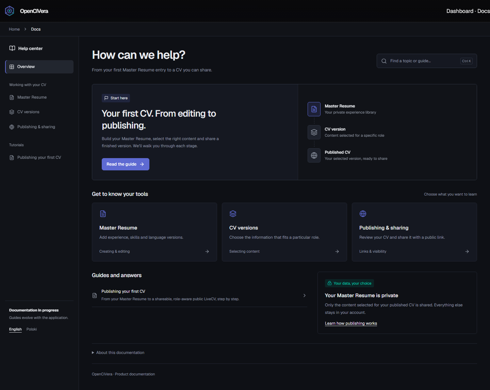

# Documentation workspace

`/docs` uses the approved knowledge-hub design (variant A), with the same Geist typography, `--ed-*` tokens, flat surfaces and shared breadcrumbs as the Dashboard. Article pages use the same shell and retain the existing Markdown renderer and heading outline.

## UI and content

- The hub presents a first-CV guide, three topic cards, available guides, privacy guidance and the original overview in an expandable section.
- Search filters topic titles/descriptions and authorized guide titles/descriptions locally. `Ctrl/Cmd+K` focuses search; clearing restores all results. It does not index entire Markdown bodies or call an API.
- Topic links resolve to existing headings in `publishing-your-first-cv`. If that guide is absent from the authorized navigation, its cards and featured link are omitted.
- English is the existing default. The documentation navigation offers Polish through `?lang=pl`; new links preserve that choice. This only changes the documentation interface. Existing English articles retain `lang="en"` and are identified as English in the Polish UI. It does not change the app language or CV language.
- The existing app theme switch controls both dark and light presentation. No additional palette, font dependency or theme store is introduced.
- Desktop topic navigation remains reachable while scrolling a long article. Below 980 px it becomes a disclosure menu; Escape closes it and restores focus to the trigger. On smaller screens the right-hand outline is hidden, with article headings and content still available.
- Breadcrumbs use `WorkspaceBreadcrumbs`: Home → Docs on the hub, Home → Docs → category → article on a detail page. Categories are plain text because no category landing routes exist. Dashboard and Master Resume keep their existing paths.

The old `.docs-shell` CSS was removed from `globals.css`; documentation styles load through `app/docs/layout.tsx` and `docs.css`. All selectors are specific to documentation except the already shared breadcrumbs. Existing images, code blocks, tables and callouts remain supported.

The old overview link to a nonexistent `creating-your-first-master-resume` document now points to the actual publication tutorial. The overview no longer introduces a second H1 inside the hub. Tutorial screenshots themselves are retained and still depict the earlier app UI; updating instructional screenshots is a separate content task.

## Access boundaries

Server pages still call `requireAuthenticatedActor`. `canViewTestScenarios` filters navigation **before** the groups are passed to the client, so restricted names/descriptions cannot appear in search or the serialized catalog. Direct scenario URLs retain their server-side 404 check:

| Role | Scenario access |
| --- | --- |
| admin | Always |
| manager, user, recruiter | Requires both `isTestUser` and the existing visibility flag |
| anonymous | Authentication required |

Resource URLs keep their existing authentication, visibility checks, traversal rejection and private caching. The Markdown sanitization/outline implementation, document URLs, publication behavior and database are unchanged.

## Regression checks

```powershell
npm.cmd run verify
$env:DOCS_BROWSER_TEST = '1'
$env:DASHBOARD_BROWSER_TEST = '1'
node --test tests/docs-browser.test.mjs tests/dashboard-browser.test.mjs
```

The opt-in browser checks require the project's Playwright Chromium installation. They compile the real React components and CSS with the existing test loader, serve them only on loopback with isolated content/API fixtures, and write screenshots to `tmp/docs-browser` and `tmp/dashboard-browser`. This is not a live Supabase or production session. No users, CVs or publications are created by these checks.

Coverage:

- `workspace-breadcrumbs.test.mjs`: existing destinations and one current page; real docs ancestors without dead category links.
- `docs-workspace.test.mjs`: topic anchors resolve to real documents in both interface languages; search normalization, empty results, language fallback and the four-role/flag catalog matrix.
- `docs-routes.test.mjs`: actual server page rendering with isolated actor/flag readers; authentication, direct scenario access, unknown routes, heading outline, image responses, private caching and traversal rejection.
- `docs-browser.test.mjs`: 24 hub/article combinations across 390/768/1440 px, PL/EN and dark/light; search/reset, actual anchor navigation, language links, sticky navigation, mobile menu/Escape/focus, eligible and empty catalogs, loaded images and no JavaScript errors.
- The existing Dashboard browser suite exercises preview, edit/save, publication error/retry, link copying and editor navigation after the breadcrumb refactor, using isolated API fixtures.

TDD evidence: the new breadcrumb tests initially failed for missing documentation ancestry, and the browser baseline reproduced the missing breadcrumb. A later browser check caught disappearing topic navigation while scrolling; the sticky sidebar fix made it pass. The server-render test caught the duplicate overview H1 before its removal. Old source-text assertions tied to the retired card layout were replaced by server-rendered and browser assertions.

Validation on 2026-09-12: `verify` passed with 580 tests passing and 3 opt-in tests skipped. The documentation and Dashboard browser suites were also explicitly enabled and passed. `npm.cmd run build -- --webpack` passed. Default Turbopack could not follow this local worktree's `node_modules` junction outside its root; no build configuration was changed. Build emitted the expected missing-Supabase-environment warning in this isolated worktree. On the locally started production server, anonymous requests to `/docs`, the tutorial and its PNG resource all returned 307 to `/login?reason=signed-out`. No live Supabase or production account was used.

## Preview images

These images are renders of the actual components with isolated data and a simplified test header:



[Mobile, light theme](assets/docs-workspace-mobile.png) · [Article, dark theme](assets/docs-article-dark.png)

## Rollout and rollback

No migration or feature flag is required. Ship through the normal application PR/deploy process. Revert the documentation implementation commit to restore the previous layout; the independently committed breadcrumb generalization can remain or be reverted after its docs consumer is removed. Do not infer a production deployment from local verification or PR creation.
